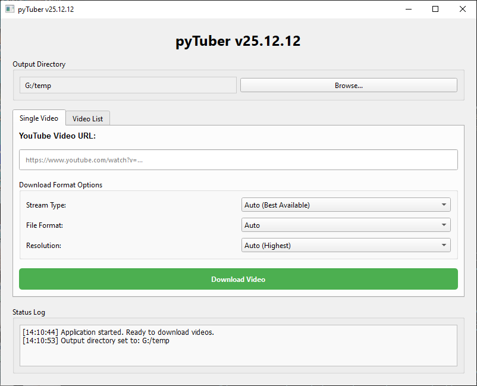

# pyTuber

A user-friendly GUI application for downloading YouTube videos


## Features

- **Single Video Download**: Download individual YouTube videos by URL
- **Batch Download**: Download multiple videos from a text file containing URLs
- **Progress Tracking**: Real-time status updates and progress indication
- **Output Directory Selection**: Choose where to save downloaded videos
- **Modern UI**: Clean, intuitive interface built with PyQt6

## Requirements

- Python 3.6 or higher
- PyQt6 6.10.0
- pytube2

## Installation

1. Install the required dependencies:

```bash
pip install -r requirements.txt
```

## Usage

1. Run the application:

```bash
python main.py
```

2. **Select Output Directory**: Click "Browse..." to choose where downloaded videos will be saved (defaults to your Downloads folder)

3. **Download Options**:

   - **Single Video Tab**: 
     - Paste a YouTube video URL
     - Click "Download Video"
   
   - **Video List Tab**:
     - Click "Select File..." to choose a text file containing YouTube URLs (one per line)
     - Click "Download from List"

4. Monitor progress in the Status Log at the bottom of the window

## Example Video List File Format

Create a text file (e.g., `videos.txt`) with one YouTube URL per line:

```
https://www.youtube.com/watch?v=VIDEO_ID_1
https://www.youtube.com/watch?v=VIDEO_ID_2
https://www.youtube.com/watch?v=VIDEO_ID_3
```

## Notes

- Downloads run in a separate thread to keep the UI responsive
- The application will prompt you before closing if a download is in progress
- All downloads are saved to the selected output directory

## License

This project uses pytube2, which is licensed under the Unlicense.

